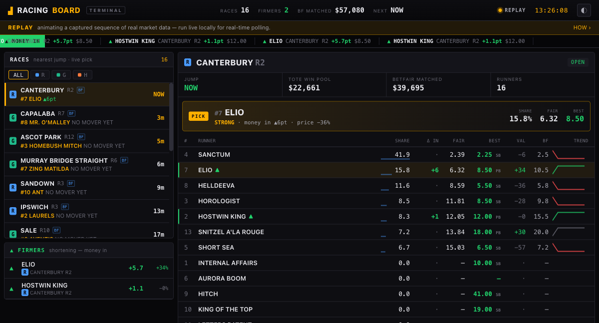

# RacingBoard 📈

Real-time board showing **where the money's going** across Thoroughbred, Greyhound
& Harness racing — a live movers leaderboard plus a per-race drill-in with tote
**pool share**, Betfair **weight of money**, who's **firming vs drifting**, and the
**best fixed odds** across Sportsbet & Pointsbet.

> Signals per runner: TAB tote pool share · TAB fixed · Betfair back/lay + weight
> of money · Sportsbet & Pointsbet win price (best-of highlighted). Ladbrokes/Neds
> and Dabble aren't included — Entain's public racecard 404s without auth, and
> Dabble's per-race fixture matching is too heavy for fast polling.

### 🔴 [Live demo](https://danieltomaro13.github.io/RacingBoard/)



## Live vs replay

- **Local (`python run.py`)** — fully live: polls Betfair + TAB every few seconds.
- **The GitHub Pages demo** — Pages only hosts static files, and a browser can't
  call TAB/Betfair directly, so it **replays a recording of real data**. To make
  the public page live, deploy the backend (below) and point the page at it.

## Run it (live, local)

```bash
python3 -m venv .venv && source .venv/bin/activate
pip install -r requirements.txt
export SPORTSDATA_MCP_SRC="/path/to/sportsdata-mcp/src"   # the data-layer engine
python run.py            # http://127.0.0.1:8000
```

No API keys needed — TAB runs off its public feed, Betfair off public read-only
endpoints. (No TAB secrets are used.)

## Make the public page live

Deploy the backend anywhere that runs Python + WebSockets, then connect the page:

- **Render** — New → Blueprint → this repo (uses `render.yaml`), or
- **Docker** — `docker build -t racingboard . && docker run -p 8000:8000 racingboard`, or
- **Local + tunnel** — `cloudflared tunnel --url http://localhost:8000` (most
  reliable: keeps your home IP, which TAB likes).

Then set `apiBase` in `docs/config.js` to the backend URL and push — or just open
`…/RacingBoard/?api=wss://your-host`.

## Common settings (env vars)

`MF_PRICE_INTERVAL` (8s) · `MF_CODES` (`R,G,H`) · `MF_JURISDICTION` (`NSW`) ·
`MF_MAX_ACTIVE_RACES` (12) · `SPORTSDATA_MCP_SRC` · `PORT`

## Rebuild the demo data

```bash
python scripts/capture_replay.py 16 5 && bash scripts/build_pages.sh && git add docs && git commit -m "refresh demo" && git push
```

MIT © Daniel Tomaro
